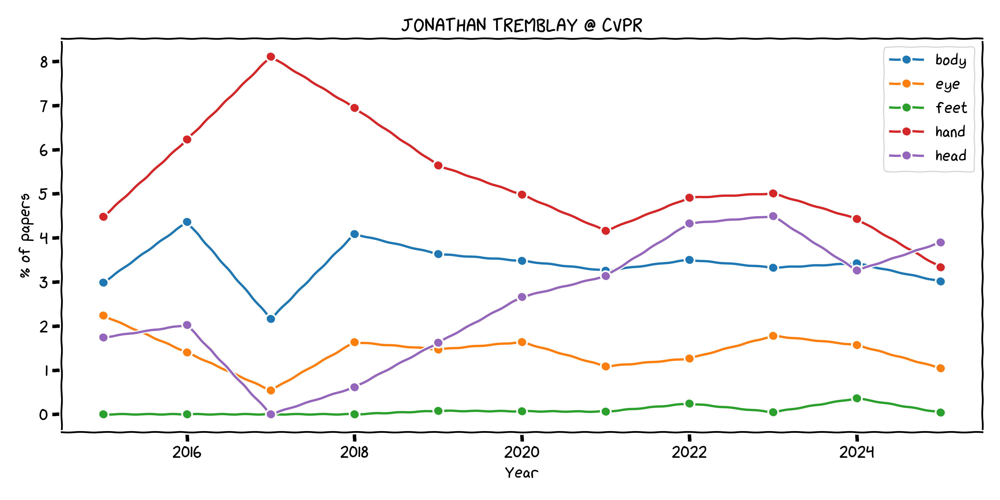

# CVPR 2015-2025 Dataset Toolkit



_Scrape → Analyse → Visualise_ &nbsp;&nbsp;|&nbsp;&nbsp; **CVPR 2015-2025**

This repository contains everything you need to:

1. **Scrape** every abstract from CVPR 2015 - 2025 (`cvpr_abstract_scraper_async.py`).
2. **Analyse** yearly keyword statistics, e.g. _robot_, _embodied_ (`cvpr_keyword_stats.py`).
3. **Visualise** those trends in a fun XKCD-style chart (`plot_keyword_trends_xkcd.py`).

The image above was generated with the new plotting script and shows the rise of robotics-related research at CVPR.

# What's in the box?

| Script | Purpose |
|--------|---------|
| `cvpr_abstract_scraper_async.py` | Ultra-fast `asyncio`+`aiohttp` scraper that fetches all CVPR papers and stores them in **JSON** / **CSV** (`cvpr_data/`). |
| `cvpr_keyword_stats.py` | Command-line utility that scans the scraped dataset for arbitrary keywords, prints pretty tables, and can export a detailed **CSV**. |
| `plot_keyword_trends_xkcd.py` | Reads the dataset and draws XKCD-style line charts showing keyword popularity over the years (optionally with a combined "Any" line). |

# Quick start

```bash
# 1) Install dependencies
pip install -r requirements.txt

# 2) Scrape the data (≈20 min for all years)
python cvpr_abstract_scraper_async.py

# 3) Inspect keyword stats
python cvpr_keyword_stats.py --keywords robot robotics embodied embodiment --save-csv stats.csv

# 4) Plot trends (with combined line and save to PNG)
python plot_keyword_trends_xkcd.py --combined --save robotics_trends.png
```

# plot_keyword_trends_xkcd.py

```
usage: plot_keyword_trends_xkcd.py [--data-file DATA] [--keywords KW [KW ...]]
                                   [--metric {percentage,count}] [--combined]
                                   [--save PATH]

--combined      Draws an extra line showing the share/count of papers that
                contain *any* of the selected keywords (no double-counting).
--metric        Choose raw counts or % of papers per year (default: %).
```

# cvpr_keyword_stats.py

```
usage: cvpr_keyword_stats.py [--data-file DATA] [--keywords KW [KW ...]]
                             [--save-csv FILE] [--sample-papers N]

Outputs a year-by-year table, trend analysis and an optional CSV with per-
keyword counts, percentages _and the combined unique count_.
```

# Dependencies

See `requirements.txt`. The only **new** runtime dependency is **matplotlib ≥ 3.7** for plotting. The XKCD font is automatically registered if `xkcd-script.ttf` is placed in the repo.

# License & Citation

This project is provided for academic / research purposes. If you use the dataset or the analysis in a publication, please cite appropriately.

---

Made with ❤️ by Jonathan Tremblay, 2025.